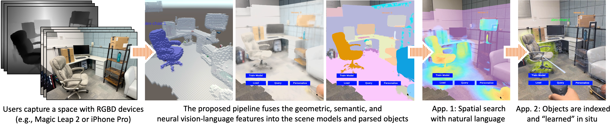
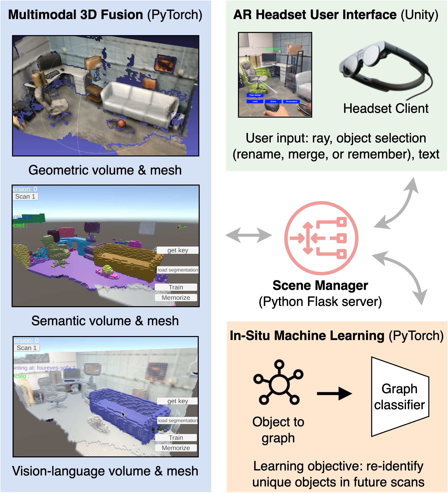
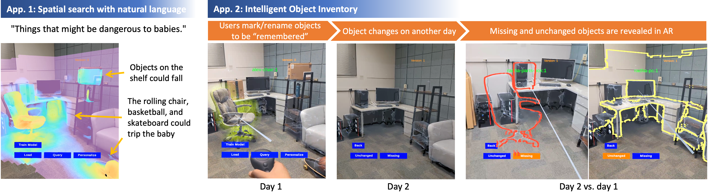

## Multimodal 3D Fusion and In-Situ Learning for Spatially Aware AI

Figure 1: This work propose a multimodal 3D reconstruction pipeline that prepares physical spaces for vision-language perception and object-level interactive machine learning. Within a few minutes after a user scans the environment, they can search the space with abstract natural language queries or create an intelligent invetory of physical objects through a novel spatially aware AI AR interface.

### Quick start

This code base includes the following key entry points:
- `./clip_seem_fusion.py`
  - The implementation for our multimodal 3D fusion pipeline
  - The multimodal 3D fusion pipeline is built on top of [Noah Stier](https://noahstier.github.io/)'s [CLIPFusion](https://github.com/noahstier/ClipFusion)
  - Figure 1 and left/blue box in Figure 2
- `./dgcnn/main_cls.py`
  - The in-situ learning module that enables user-guided machine learning involving physical objects 
  - Bottom-right/orange box in Figure 2
- `./app_unity.py`
  - The Flask server that launches the entire system. It initializs the 3D reconstruction pipline and the in-situ leanring model, and communicate with the AR headset Unity-built client over http requests
  - Scene Manager & top-right/green box in Figure 2

The following supporting modules are also included:
- `./test_client_requests.py`
  - For development, here you can simulate user input without connecting to the Unity or Magic Leap 2 UI
- `./test_natural_language_query.py`
  - Testing the spatial search queries quickly, a `*.ply` model is returned for visualization
- `./kmax`
  - The panoptic segmentation packge ([k-means mask Transformer](https://arxiv.org/pdf/2207.04044.pdf)) used in our workflow
- `./dgcnn`
  - [The Dynamic Graph CNN](https://arxiv.org/pdf/1801.07829) that we used as the backbone neural network for in-situ learning

<!-- - `./seem`
  - An alternative segmentaion solution we also integrated into our pipeline ([Segment Everything Everywhere All at Once](https://arxiv.org/pdf/2304.06718.pdf)) to support open-language 3D segmentation -->

*Figure 2: System overview*

> More descriptive system design and implementation details can be found in our paper (pending release).

### Data and pre-trained models

- We will provide demo data for you to get started fast (pending release)
- The simplest way to test this system with your own space is using iPhone's [3d Scanner App™](https://apps.apple.com/us/app/3d-scanner-app/id1419913995)
  - Make sure your phone has a depth sensor as use the LiDAR Normal mode
  - Export "All Data" to ensure RGB images, depth maps, and camera poses are all included
  - Place the exported data in `./scenes/iphone_3dscanner/v00` as input to our system
  - Follow-up scans of the same space goes into `../v01` etc. for Scene Manager to handle multiple versions
- For Panoptic Segmentation, we used the [ConvNeXt-Large](https://github.com/bytedance/kmax-deeplab) model pre-trained on COCO Panoptic Segmentation

If everything works as expected, here is what you will be able to do/see 

*Figure 3: Two prototype applications through the Magic Leap 2 interface*

### python environment setup

1. `environment.yml` includes all necessary packages 
2. Please follow [k-means mask Transformer](https://github.com/bytedance/kmax-deeplab) for additional environment setup

### Magic Leap 2 Demos

We are unable to open-source the Unity code for the Magic Leap 2 demo due to licensing restrictions. We are happy to share relevant portions of the code however, and provide support in recreating the project and/or porting to a new device. Please contact rkumaran@ucsb.edu for more information.

### Paper Abstract
Seamless integration of virtual and physical worlds in augmented reality benefits from the system semantically "understanding" the physical environment. AR research has long focused on the potential of context awareness, demonstrating novel capabilities that leverage the semantics in the 3D environment for various object-level interactions. Meanwhile, the computer vision community has made leaps in neural vision-language understanding to enhance environment perception for autonomous tasks. In this work, we embed both semantic and linguistic knowledge into the geometric scene representation, enabling user-guided machine learning involving physical objects. We first present a fast multimodal 3D reconstruction pipeline that brings linguistic understanding to AR by fusing CLIP vision-language features into the environment and object models. We then propose "in-situ" machine learning, which, in conjunction with the multimodal semantic representation enables new tools and interfaces for users to interact with physical spaces and objects in a spatially and linguistically meaningful manner. We demonstrate the usefulness of the proposed system through two real-world AR applications on Magic Leap 2: a) spatial search in physical environments with natural language and b) an intelligent inventory system that tracks object changes over time. We also make our full implementation and demo dataset available to encourage further exploration and research in spatially aware AI.

